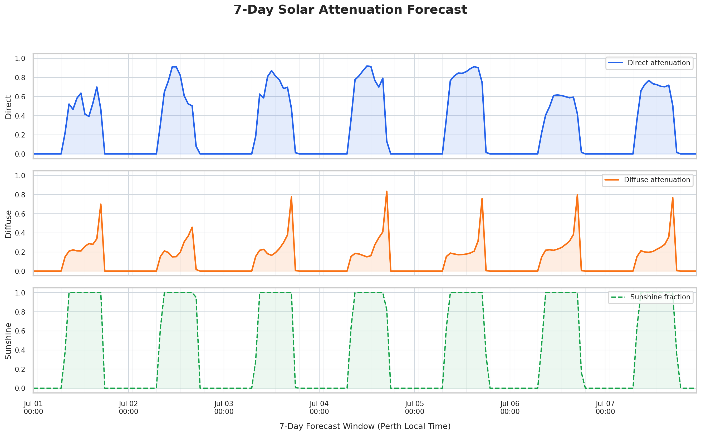
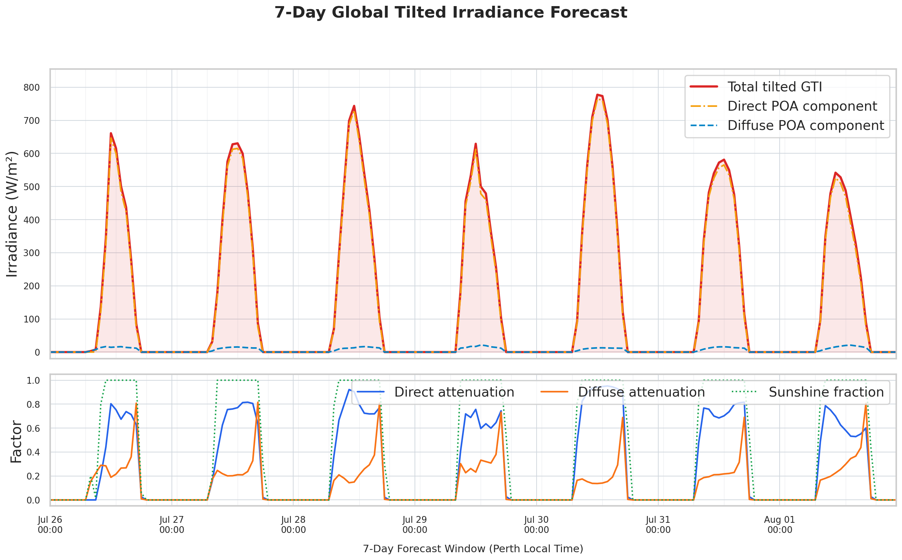

# Solar Yield Forecasting MLOps Pipeline

End-to-end Databricks Free Edition project for forecasting solar irradiance attenuation and converting it into **Global Tilted Irradiance (GTI)** for a physical solar array in Perth, Western Australia.

The project combines live weather ingestion, physics-based solar geometry, multi-output machine learning, MLflow model tracking, and a scheduled daily inference workflow.

Latest attenuation forecast:



Latest plane-of-array GTI forecast:



## Why This Project Matters

Solar operators need forecasts that are more useful than raw weather variables. This pipeline predicts direct and diffuse clear-sky attenuation factors from atmospheric conditions, then projects those factors onto a tilted panel plane using `pvlib`. The result is an operational 7-day GTI profile that can support yield planning, dashboards, or downstream energy analytics.

## Architecture

```text
Open-Meteo API
    |
    v
Bronze: hourly weather forecast and historical weather observations
    |
    v
Silver: normalized cloud, humidity, sunshine, pressure, and clear-sky features
    |
    v
MLflow model: weighted chained XGBoost multi-output regressor
    |
    v
Physics layer: pvlib clear-sky and plane-of-array GTI projection
    |
    v
Gold: hourly 7-day solar attenuation and GTI forecast
```

## Repository Layout

```text
.
├── SolarEnergy_Pipeline.ipynb          # Databricks training and MLflow registration notebook
├── SolarEnergy_daily_inference.ipynb   # Databricks scheduled daily inference notebook
├── src/solar_yield/                    # Reusable feature, quality, config, and physics utilities
├── tests/                              # Unit tests for reusable pipeline logic
├── docs/MODEL_CARD.md                  # Model intent, inputs, guardrails, and limitations
├── requirements.txt                    # Runtime dependencies
├── requirements-dev.txt                # Test/lint dependencies
└── 7_Day_GTI_Power_Yield_Profile.png   # Example GTI forecast artifact
```

## MLOps Features

- **Databricks workflow design:** separate training and inference notebooks with Bronze/Silver/Gold layer semantics.
- **MLflow tracking:** model training runs are logged and inference loads the registered run artifact.
- **Reusable code:** common feature engineering, data quality checks, asset configuration, and GTI projection logic live under `src/solar_yield`.
- **Data quality checks:** hourly forecast batches can be validated for row count, timestamp uniqueness, continuous cadence, and required columns.
- **Physical guardrails:** inference clips impossible model outputs and applies night/overcast rules before GTI projection.
- **Portfolio-safe publishing:** the scheduled inference notebook can publish the refreshed forecast image to GitHub using a Databricks Secret Scope token without storing credentials in source control.

## Model Approach

The training notebook builds a two-target model for:

- `direct_clear_sky_factor`
- `diffuse_clear_sky_factor`

The final approach uses:

- `XGBRegressor` as the base estimator.
- `RegressorChain` to let the diffuse prediction depend on the direct prediction.
- Interior sample weighting to prioritize dynamic daylight observations over stable physical boundaries.
- Post-processing constraints to keep predictions inside physically meaningful `[0, 1]` bounds.

## Databricks Usage

1. Import the notebooks into Databricks Free Edition.
2. Install dependencies from `requirements.txt` or run the `%pip install ...` cell in each notebook.
3. Run `SolarEnergy_Pipeline.ipynb` to ingest historical data, engineer features, train the model, and log it to MLflow.
4. Set the `model_run_id` Databricks widget to the chosen MLflow run ID from training.
5. Schedule `SolarEnergy_daily_inference.ipynb` as a Databricks Workflow to refresh the 7-day forecast.

Recommended production parameters:

```python
LATITUDE = -31.95
LONGITUDE = 115.86
TZ = "Australia/Perth"
SURFACE_TILT = 25.0
SURFACE_AZIMUTH = 0.0
ALBEDO = 0.2
```

## Local Validation

The reusable Python logic can be tested outside Databricks:

```bash
python3 -m venv .venv
source .venv/bin/activate
pip install -r requirements-dev.txt
pytest
```

## Security Notes

- Keep GitHub tokens and Databricks secrets in Databricks Secret Scopes or environment variables.
- Do not hard-code personal access tokens, clone URLs with embedded credentials, or private run IDs.
- The daily inference notebook uses `dbutils.secrets.get(scope="github", key="GITHUB_TOKEN")` and a GitHub token-backed git push to publish refreshed forecast images to the `main` branch.
